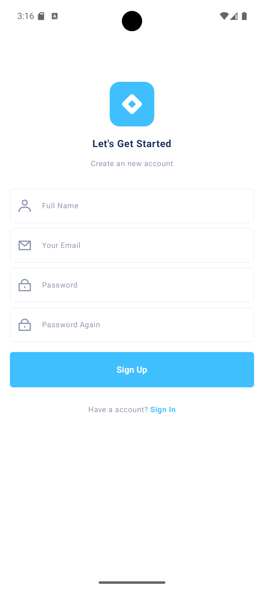
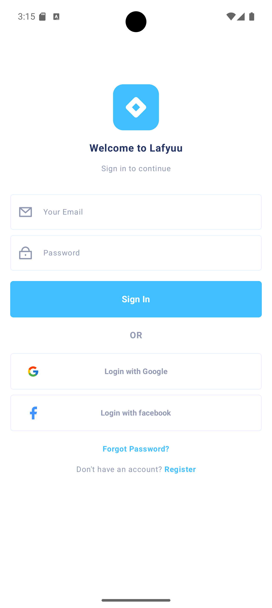
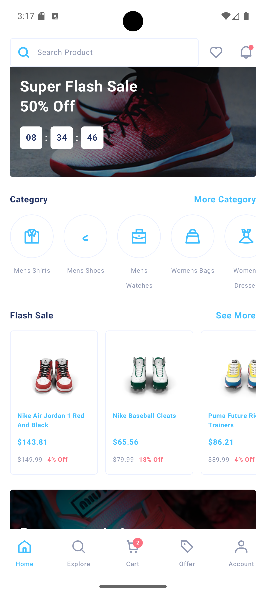
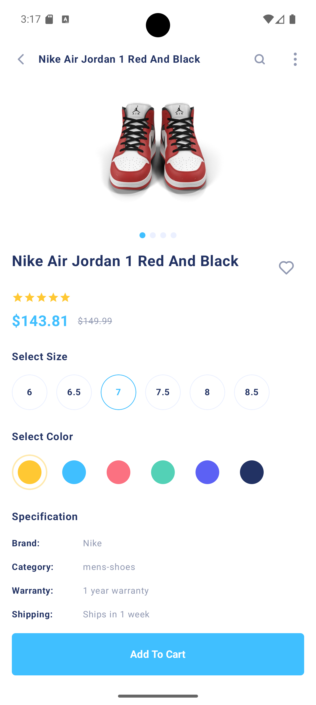

# Lafyuu - Modern E-Commerce Android Application

<p align="center">
  
  
  
  
</p>

**Lafyuu** is a modern, feature-rich e-commerce Android application built with native Android development tools and Jetpack Compose. It provides a seamless shopping experience with a clean UI, secure authentication flows, flash sales, product categorization, and interactive rating systems.

---

## 🚀 Features

- **User Authentication:** Secure registration and login screens with input validation.
- **Dynamic Home Screen:** Features Flash Sale banners, category navigation, and product grids.
- **Interactive UI Components:** Custom-built `AuthTextField`, `ProductCard`, `StarRating`, and `PrimaryButton`.
- **State Management:** Reactive UI updates powered by ViewModel and `StateFlow`.
- **Dependency Injection:** Clean and scalable architecture managed using **Hilt**.
- **Modern Design System:** Built entirely with **Jetpack Compose** and **Material 3**, supporting custom theme colors.

- ## 📱 Screenshots

| Register Screen | Login Screen | Home Screen | Product Details |
| :---: | :---: | :---: | :---: |
|  |  |  |  |

---

## 🛠️ Tech Stack & Architecture

- **Language:** [Kotlin](https://kotlinlang.org/)
- **UI Toolkit:** [Jetpack Compose](https://developer.android.com/jetpack/compose) & Material 3
- **Architecture Pattern:** MVVM (Model-View-ViewModel)
- **Dependency Injection:** [Hilt](https://dagger.dev/hilt/)
- **Asynchronous Programming:** Kotlin Coroutines & Flow
- **Navigation:** Jetpack Navigation Component

---

## 📂 Project Structure

```text
com.example.lafyuu_projectfinal/
│
├── model/           # Data models (Product, Category, etc.)
├── screen/          # Composable screens (Register, Login, Home, etc.)
│   ├── components/  # Reusable UI widgets (AuthTextField, StarRating, ProductGrid)
│   └── register/    # Register screen & ViewModel
└── ui/theme/        # Color palette, typography, and shapes
